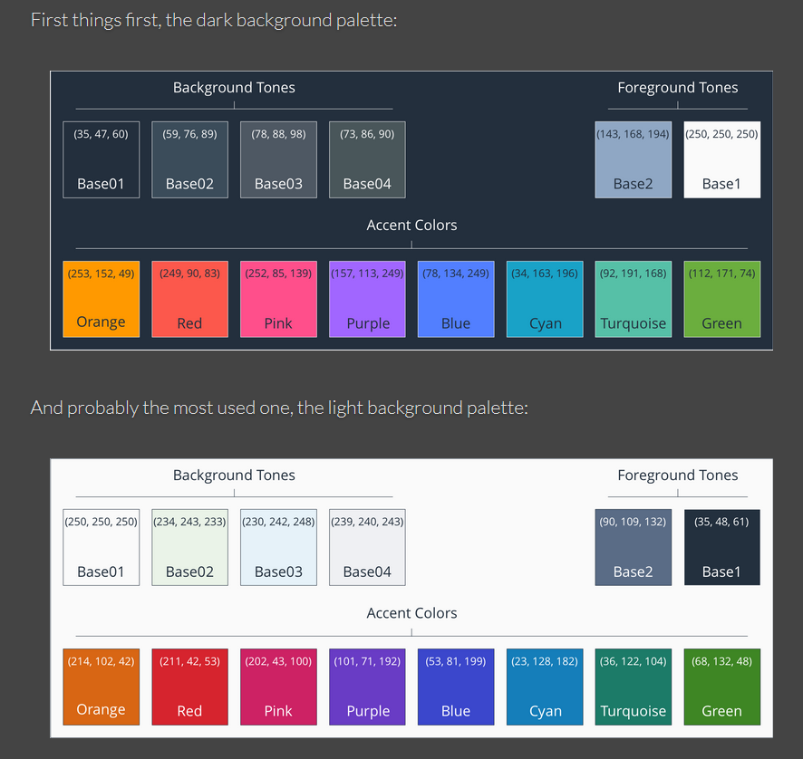

# aws-reinvent-palette
Colors palette (css) utilizing AWS re:Invent colors.

This is a personal project to create a css file based upon AWS re:Invent colors and usable with W3.CSS.

Based upon a color palette created by Adrian Simionov.

# links

[https://www.w3schools.com/w3css](https://www.w3schools.com/w3css/default.asp)

[https://adrian.simionov.io](https://adrian.simionov.io/aws/2020/04/24/aws-color-palette.html)

